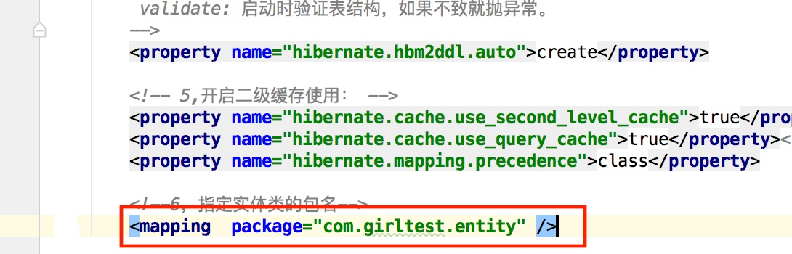
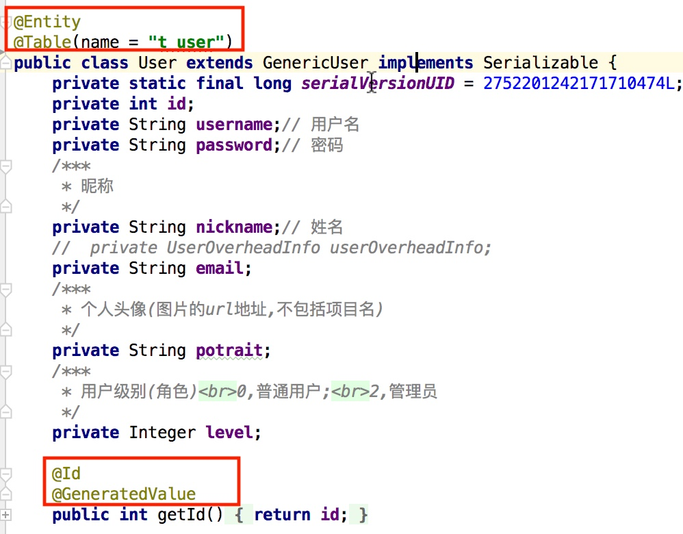
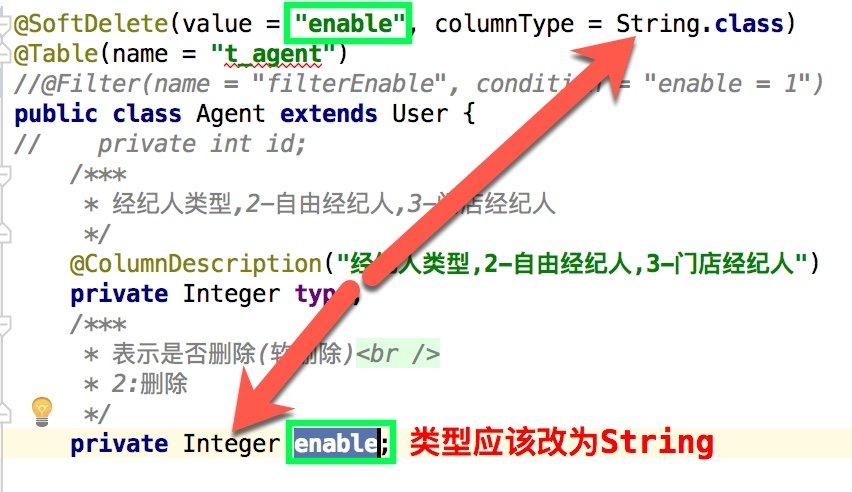
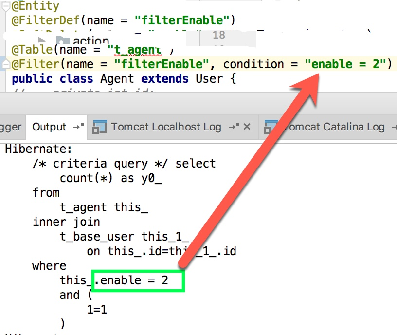
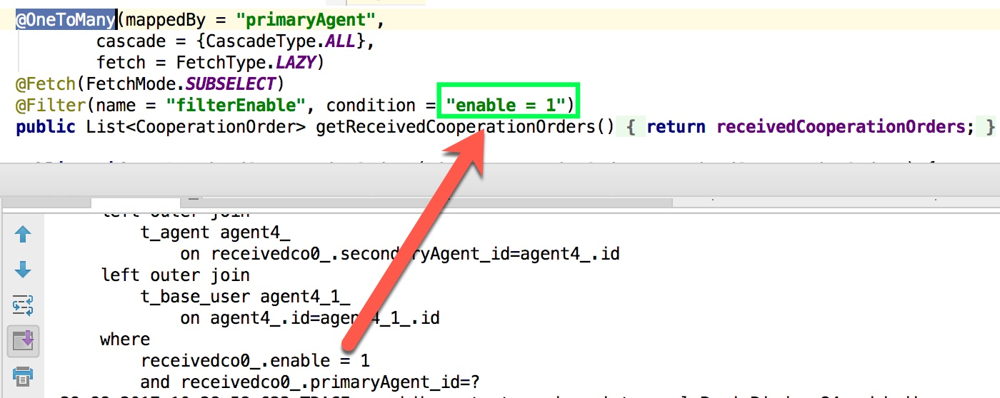
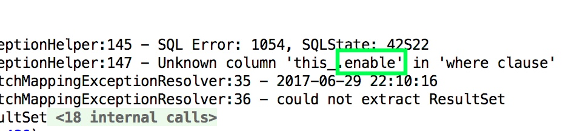

## 简介
1. 该项目封装了所有的DAO 操作,包括增删改查.
2. 使用时,新建DAO类,只要继承GenericDao<T> 就会自动拥有常用的DAO操作,
例如:

```java
import com.common.dao.generic.GenericDao;
import com.girltest.entity.Girl;
import org.springframework.stereotype.Component;

@Component("girlDao")
public class GirlDao extends GenericDao<Girl> {

}

```

## 代码结构
GenericDao 继承了com.common.dao.generic.UniversalDao
### 工具类/接口
|类名|功能|
| -------- | -------------- |
|.util.CreateSQLHelper|根据hibernate注解自动生成建表sql|
|.util.RedisHelper|redis 操作工具类|
|.util.PageUtil|分页|
|.web.filter.SimpleCORSFilter|支持跨域的拦截器|
|.web.servlet.verifycode.RandomCodeServlet|图形验证码|


## 对hibernate的扩展
hibernate 配置文件hibernate.cfg.xml 中
```xml
<mapping  package="com.girltest.entity" />
``` 
并不好使.
所以我进行了扩展,
WildCardConfiguration 是我自定义的类,继承
org.hibernate.cfg.Configuration
### 使用
see com.common.util.CreateSQLHelper
### 自动生成SQL语句
see com.common.util.CreateSQLHelper

```java
/***
     * 不会真正在数据库中创建表,仅生成SQL语句<br />
     * 会自动读取classpath中的hibernate.cfg.xml,若没有该文件,请创建
     */
    public static void generateCreateTableSql() {
        generateCreateTableSql(null);
    }
    /***
     * 生成建表的SQL语句
     * @param resource
     */
    public static void generateCreateTableSql(String resource) {
        org.hibernate.cfg.Configuration configuration = null;
        if (ValueWidget.isNullOrEmpty(resource)) {
            //会自动读取classpath中的hibernate.cfg.xml,若没有该文件,请创建
            configuration = new
                    WildCardConfiguration().configure();
        } else {
            configuration = new
                    WildCardConfiguration().configure(resource);
        }
        new SchemaExport(configuration).create(true, false);
    }
```
 ----
 具体方法:
 1. 创建hibernate.cfg.xml
 
2. 上述文件中package 下的所有类需要增加注解

3. 编写单元测试,并运行
 
```java

@Test
    public final void test_exportSQL() {
        CreateSQLHelper.generateCreateTableSql();
    }
```

## 软删除
有时我们删除业务数据,比如生成一个订单,我们并不会真正物理删除,而是修改某个字段.这就是软删除.  
### 使用方法
1. 在实体类增加注解:  
 
```java
@SoftDelete(value = "enable", columnType = String.class)
``` 
SoftDelete 的value 表示数据库中字段的名字;  
columnType 表示数据库中字段的类型.  
支持:String、Int、Byte、Short、Long,short

2. 实体类增加字段  
实体类需要增加value标示的字段,例如"enable"  


### 注意
SoftDelete 的columnType 必须与实体类中成员变量的类型相同

## 关联查询时增加额外条件
关联抓取时增加where语句 
使用方法: 使用hibernate的注解@Filter  
分为两种:
1. 实体类上面的@Filter;  
2. OneToMany 注解上的@Filter

### 实体类上的@Filter
只作用域当前的实体类查询  
  

```java
@Entity
@FilterDef(name = "filterEnable")

@Table(name = "t_agent")
@Filter(name = "filterEnable", condition = "enable = 2")
```

### @OneToMany上的@Filter
  

```java
@OneToMany(mappedBy = "primaryAgent",
            cascade = {CascadeType.ALL},
            fetch = FetchType.LAZY)
    @Fetch(FetchMode.SUBSELECT)
    @Filter(name = "filterEnable", condition = "enable = 1")
```

### 实体类的dao必须实现 **enableFilter(Session session)** 方法

```java
@Override
    protected void enableFilter(Session session) {
        session.enableFilter("filterEnable");
    }
```

### 注意
1. enable 必须放在当前实体类中,而不能放在父类中   
否则就会报错:  


2. enable:1表示有效;2表示已经删除

